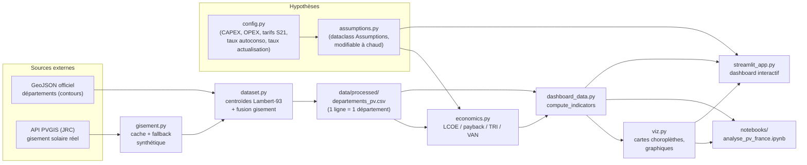

# Dossier technique — Potentiel photovoltaïque tertiaire en France

> Document parapluie compilant l'ensemble des livrables du projet « workshop
> client » mené pour **Oxand** (outil **Simeo**), en vue de sa présentation au
> jury. Il renvoie vers les documents détaillés plutôt que de les dupliquer.

---

## 1. Présentation de la demande client

**Client** : Oxand, éditeur de l'outil **Simeo**, qui évalue les économies
énergétiques apportées par les actions de rénovation dans le tertiaire
(décret tertiaire, RE2020…). Simeo couvre aujourd'hui l'**efficacité
énergétique passive** (isolation, ventilation, équipements) ; le client
souhaite explorer l'ajout d'un futur volet **production locale d'énergie**,
au premier rang duquel le photovoltaïque.

**Demande** : un projet exploratoire d'une semaine visant à *caractériser le
terrain de jeu* de ce futur module — sans le construire — en répondant à
trois questions pour une toiture tertiaire type :

1. Combien produit-elle (gisement solaire) ?
2. Combien coûte-t-elle (CAPEX/OPEX) ?
3. Est-elle rentable (LCOE, payback, TRI, VAN) ?

**Périmètre retenu** : France métropolitaine, toitures tertiaires **9 à
500 kWc**, granularité **départementale** (≈96 unités), à l'exclusion d'une
extension européenne, d'un suivi du parc installé, ou d'une analyse bâtiment
par bâtiment (rôle de Simeo, hors périmètre ici).

Le rappel complet du contexte réglementaire (décret tertiaire, loi APER,
RE2020, REPowerEU), des enjeux économiques et géographiques, du glossaire et
des ordres de grandeur indicatifs (Annexe A) figure dans la note de cadrage :
**[`potentiel-pv-france-note-cadrage.md`](../potentiel-pv-france-note-cadrage.md)**.

---

## 2. Démarche & architecture technique

### 2.1 Démarche

Le projet suit une logique de pipeline reproductible : collecte des données
géographiques et de gisement solaire → consolidation en une table
départementale → modèle économique paramétrable → couche de préparation pour
la restitution → restitution (notebook narratif + dashboard interactif). Le
code est développé en TDD (`tests/`), avec des hypothèses économiques
centralisées et jamais codées en dur dans la logique métier, pour rester
auditables et facilement révisables en un seul endroit (`config.py` / la
dataclass `Assumptions`).

### 2.2 Modules et rôles

| Module | Rôle |
|---|---|
| `src/config.py` | Source unique des hypothèses par défaut (CAPEX par tranche, OPEX, tarifs S21, taux d'autoconsommation, taux d'actualisation, paramètres PVGIS, URLs des données géographiques, paramètres du fallback synthétique). Aucune valeur en dur ailleurs dans le code. |
| `src/assumptions.py` | Regroupe les hypothèses de `config.py` dans une dataclass immuable `Assumptions`. Permet au dashboard d'injecter des jeux d'hypothèses modifiés (`dataclasses.replace`) sans toucher au code métier ; `Assumptions.default()` garantit la rétrocompatibilité avec `config.py`. |
| `src/gisement.py` | Récupère le gisement solaire réel via l'API **PVGIS** (JRC, Commission européenne) pour un couple (latitude, longitude) : facteur de production (kWh/kWc/an) et irradiance (kWh/m²/an). Gère un **cache local** (évite de rappeler l'API) et un **fallback synthétique** (gradient linéaire Nord–Sud) si PVGIS est indisponible, avec traçabilité de la source (`pvgis` vs `synthetique`). |
| `src/dataset.py` | Pipeline de constitution de la table départementale : téléchargement du GeoJSON officiel des départements, calcul des centroïdes (projection métrique Lambert-93 EPSG:2154 pour un centroïde géométriquement correct, puis reprojection WGS84), appel de `gisement` pour chaque département, fusion et écriture du CSV consolidé `data/processed/departements_pv.csv`. |
| `src/economics.py` | Modèle économique pur (fonctions sans état, paramétrées par un objet `Assumptions` optionnel) : CAPEX/OPEX par tranche de puissance, prix de valorisation de l'énergie selon le régime (autoconsommation avec vente du surplus / vente totale), flux de trésorerie annuels, VAN, TRI (bissection), LCOE, payback. |
| `src/dashboard_data.py` | Couche de préparation des données pour la restitution, sans aucune logique d'interface : `compute_indicators` enrichit la table départementale avec LCOE/payback/TRI/VAN calculés via `economics`, `load_departements`/`load_geodata` chargent les tables consolidées. Fonctions pures et testées indépendamment de Streamlit. |
| `src/viz.py` | Génère les visualisations (cartes choroplèthes départementales, diagrammes en barres simples et groupés) à partir de `matplotlib`, réutilisées à la fois par le notebook et par le dashboard. |
| `streamlit_app.py` | Dashboard interactif : réutilise exclusivement `src/` (aucune logique métier propre), expose les hypothèses modifiables via une barre latérale (régime, puissance, OPEX, prix évité, taux d'autoconsommation, taux d'actualisation, multiplicateur CAPEX) et recalcule en direct les KPI nationaux, la carte choroplèthe, le détail par département et l'analyse de sensibilité. |

### 2.3 Flux de données



La règle d'architecture centrale : **les données réelles (PVGIS, GeoJSON) et
les hypothèses (config/assumptions) sont strictement séparées** des
indicateurs calculés (`economics.py`), ce qui garantit que toute modification
d'hypothèse (via le dashboard ou `config.py`) se propage de façon cohérente
et traçable jusqu'aux résultats affichés.

---

## 3. Sources de données & nature

Transparence sur la nature de chaque donnée utilisée (reprise du tableau du
[`README.md`](../README.md)) :

| Catégorie | Source | Nature |
|---|---|---|
| Facteur de production, irradiance | **PVGIS** (JRC) | **Récupérée, fiable** |
| Contours / centroïdes départements | GeoJSON officiel | **Récupérée, fiable** |
| CAPEX, OPEX, tarifs S21, taux | Note de cadrage (Annexe A) | **Hypothèses** explicites |
| LCOE, payback, TRI, VAN | Modèle `economics.py` | **Calculées** (reproductibles) |

Cette distinction (réel / hypothèse / calculé) est également le pilier de la
gestion du risque « hypothèses économiques datées ou approximatives »
documentée dans le [document de pilotage](pilotage-projet.md), section 4.

---

## 4. Résultats & analyse

L'analyse narrative complète — construction du jeu de données, exploration
du gisement, modélisation économique, analyse de sensibilité — est disponible
dans le notebook reproductible :
**[`notebooks/analyse_pv_france.ipynb`](../notebooks/analyse_pv_france.ipynb)**
(généré par `scripts/build_notebook.py`, exécutable via
`python -m jupyter nbconvert --to notebook --execute --inplace notebooks/analyse_pv_france.ipynb`).

Quelques chiffres clés qui en ressortent, calculés sur les 96 départements de
France métropolitaine à partir des données **PVGIS réelles** (aucune valeur
issue du fallback synthétique dans le jeu de données consolidé actuel) :

- **Facteur de production** : de **1 029** à **1 478 kWh/kWc/an** selon le
  département — un écart cohérent avec le gradient Nord-Sud attendu (Annexe A
  de la note de cadrage : ~900 Nord à ~1 500 Sud), confirmé empiriquement par
  l'appel PVGIS sur chaque centroïde départemental plutôt que supposé.
- **LCOE** : de l'ordre de **6 à 10 c€/kWh** pour une installation de
  référence de 100 kWc, en ligne avec la fourchette indicative de la note de
  cadrage (Annexe A) et vérifié par le test `test_lcoe_in_plausible_range`.
- **Payback** : **8 à 14 ans** selon le régime de valorisation et le
  département — les scénarios d'autoconsommation avec vente du surplus
  (taux par défaut 65 %, sensibilité testée à 40/65/90 %) ressortent
  significativement plus rentables que la vente totale au tarif S21 (payback
  9–15 ans), confirmant le constat de la note de cadrage (§1.2 et §2.2) selon
  lequel l'autoconsommation est aujourd'hui la valorisation la plus
  avantageuse pour le tertiaire.

---

## 5. Dashboard

**Objet** : dashboard Streamlit permettant à Oxand d'explorer les résultats par
département. Les hypothèses économiques sont **fixes** (celles de la note de
cadrage) et affichées pour transparence ; l'utilisateur choisit le **régime de
valorisation** (autoconsommation / vente) et la **puissance** de l'installation.
Le dashboard présente les indicateurs nationaux, une carte choroplèthe, le
détail par département avec un **verdict de rentabilité**, une analyse de
sensibilité et l'export des données en CSV.

**Fonctionnalités** :
- synthèse nationale (LCOE, payback, TRI, VAN moyens) ;
- carte choroplèthe départementale sur l'indicateur choisi (facteur de
  production, LCOE, payback, TRI) ;
- détail par département avec courbe de cash-flow cumulé ;
- analyse de sensibilité au taux d'autoconsommation (40/65/90 %) ;
- export des données enrichies au format CSV.

**Exécution locale** :
```powershell
python -m streamlit run streamlit_app.py
```

**En ligne** : <https://imeneee01-workshop-client-3-streamlit-app-kzifeo.streamlit.app/>
(déployé sur Streamlit Community Cloud).

_(captures d'écran à insérer)_

---

## 6. Recettage formalisé

**Synthèse de l'exécution réelle** (commande `python -m pytest -v`, exécutée
le 02/07/2026) :

```
$ python -m pytest -v
...
tests/test_assumptions.py ...        (3)
tests/test_dashboard_data.py ...     (3)
tests/test_dataset.py .              (1)
tests/test_economics.py ............ (16)
tests/test_gisement.py ...           (3)
tests/test_viz.py ..                 (2)
======================= 28 passed, 2 warnings in 6.36s =======================
```

**28 tests, tous passants** (0 échec). Les 2 avertissements (`DeprecationWarning`
dans `pyproj`, lors de la conversion tableau→scalaire sur le calcul de
centroïde) sont sans incidence fonctionnelle et proviennent d'une dépendance
tierce, pas du code du projet.

### Plan de test

| Cas testé | Attendu | Résultat |
|---|---|---|
| `Assumptions.default()` reflète `config.py` (taux d'actualisation, durée de vie, OPEX, prix autoconso, taux autoconso) | Les valeurs par défaut de la dataclass correspondent exactement aux constantes de `config.py` | **Passé** |
| Tranches CAPEX / tarifs de vente copiées en tuple dans `Assumptions` | `capex_brackets` et `vente_tariffs` identiques (en tuple) à `config.CAPEX_BRACKETS` / `config.VENTE_TARIFFS` | **Passé** |
| Immutabilité de `Assumptions` | Toute tentative de modification d'un champ lève une exception (dataclass `frozen=True`) | **Passé** |
| `compute_indicators` ajoute les colonnes d'indicateurs | Colonnes `lcoe`, `payback`, `tri`, `van` présentes, même nombre de lignes en sortie | **Passé** |
| Un meilleur gisement donne une VAN plus élevée | Département au facteur de production plus élevé (06 vs 01) → VAN supérieure | **Passé** |
| Un CAPEX plus élevé augmente le LCOE | Jeu d'hypothèses avec CAPEX renchéri (3000 €/kWc) → LCOE moyen supérieur au cas de base | **Passé** |
| Calcul des centroïdes départementaux | Centroïde d'un polygone test (calculé en Lambert-93 EPSG:2154 puis reprojeté WGS84) proche du centre attendu (lat/lon) à 0,01° près | **Passé** |
| CAPEX unitaire par tranche de puissance | 20 kWc → 1850 €/kWc ; 50 kWc → 1400 €/kWc ; 300 kWc → 1100 €/kWc (bornes des tranches respectées) | **Passé** |
| CAPEX total | 100 kWc (tranche 100-500) → 100 × 1100 € | **Passé** |
| Tarif de vente S21 par tranche | 50 kWc → 0,10 €/kWh ; 300 kWc → 0,08 €/kWh | **Passé** |
| Dégradation annuelle de la production | Production année 1 = référence exacte ; année 2 strictement inférieure (dégradation 0,5 %/an) | **Passé** |
| VAN à taux zéro = somme des flux | VAN(0 %) égale la somme brute des cash-flows (à 1e-9 près) | **Passé** |
| VAN actualise correctement les flux futurs | Flux de 110 € à l'année 1 actualisé à 10 % → VAN nulle pour un investissement de 100 € | **Passé** |
| TRI retrouve un taux connu | Cash-flows construits pour un TRI de 10 % → `irr()` restitue 10 % à 1e-4 près (bissection) | **Passé** |
| Structure des flux de trésorerie | Longueur = `PROJECT_YEARS` + 1 ; année 0 négative (investissement) ; année 1 positive (revenu net) | **Passé** |
| Remplacement onduleur impacte le cash-flow | Flux de l'année de remplacement (année 12) strictement inférieur à l'année précédente | **Passé** |
| LCOE dans une fourchette plausible | Pour 100 kWc / facteur 1100 kWh/kWc/an : LCOE entre 4 et 12 c€/kWh (cohérent Annexe A) | **Passé** |
| Un meilleur gisement améliore le TRI | Facteur de production 1500 (Sud) → TRI supérieur à facteur 900 (Nord) | **Passé** |
| Le payback tombe dans l'horizon du projet | Pour un cas favorable (facteur 1300), payback compris entre 1 et `PROJECT_YEARS` | **Passé** |
| Le prix autoconsommation est une moyenne pondérée | Prix compris strictement entre le tarif de vente S21 et le prix évité plein (`AUTOCONSO_PRICE`) | **Passé** |
| Un taux d'autoconsommation plus élevé augmente le prix moyen | Prix à 90 % d'autoconso > prix à 40 % | **Passé** |
| `Assumptions.default()` reproduit exactement le comportement historique (sans objet `a`) | `capex_per_kwc` et `lcoe` donnent le même résultat avec ou sans `a=Assumptions.default()` explicite | **Passé** |
| Un CAPEX personnalisé modifie le payback | Jeu d'hypothèses CAPEX renchéri → payback strictement supérieur au cas de base | **Passé** |
| Fallback synthétique : Sud plus ensoleillé que Nord | `fallback_facteur(lat_sud) > fallback_facteur(lat_nord)` | **Passé** |
| Fallback synthétique : valeurs aux bornes | Aux latitudes de référence Sud/Nord, le facteur retourné correspond aux constantes `FALLBACK_FACTEUR_SOUTH`/`NORTH` à 1 kWh près | **Passé** |
| Fallback synthétique : valeur intermédiaire cohérente | Au centre de la France (lat 46°), facteur strictement compris entre les bornes Nord et Sud | **Passé** |
| Carte choroplèthe génère bien une figure | `choropleth()` sur un GeoDataFrame factice retourne une figure matplotlib avec au moins un axe | **Passé** |
| Diagramme en barres génère bien une figure | `bar_chart()` retourne une figure matplotlib non nulle | **Passé** |

**Fichiers de test** (`tests/`) et ce qu'ils couvrent :

| Fichier | Couverture |
|---|---|
| `tests/test_assumptions.py` | Cohérence de la dataclass `Assumptions` avec `config.py`, copie des tranches, immutabilité |
| `tests/test_dashboard_data.py` | Enrichissement de la table départementale par `compute_indicators`, sensibilité au gisement et au CAPEX |
| `tests/test_dataset.py` | Calcul géométrique des centroïdes départementaux (projection Lambert-93) |
| `tests/test_economics.py` | Cœur du modèle économique : CAPEX/OPEX par tranche, tarifs de vente, dégradation, VAN, TRI, LCOE, payback, sensibilité au taux d'autoconsommation, compatibilité avec `Assumptions` |
| `tests/test_gisement.py` | Comportement du fallback synthétique (gradient Nord-Sud) en cas d'indisponibilité de PVGIS |
| `tests/test_viz.py` | Génération effective des figures (choroplèthe, barres) sans erreur |

---

## 7. Limites & suites possibles

**Limites assumées du périmètre actuel** (cf. note de cadrage §3.1 et
`README.md`) :

- **Échelle territoriale agrégée** : l'analyse est menée au niveau
  départemental, pas bâtiment par bâtiment — cette granularité fine relève du
  rôle futur de **Simeo**, pas de ce projet exploratoire.
- **France métropolitaine uniquement** : l'extension à l'échelle
  **européenne** (mentionnée comme optionnelle/bonus dans la note de cadrage)
  n'a pas été réalisée, faute de temps dans le format d'une semaine (choix
  YAGNI assumé et documenté dans le registre des risques du
  [document de pilotage](pilotage-projet.md)).
- **Pas de suivi du parc installé** : le projet caractérise le potentiel
  (gisement, technique, économique) mais ne compare pas à la réalité du
  déploiement actuel (MW installés par département), qui aurait permis de
  qualifier les frictions gisement → réalisé évoquées dans la note de
  cadrage (§1.4).
- **Hypothèses économiques indicatives** : CAPEX, OPEX et tarifs S21
  proviennent de l'Annexe A de la note de cadrage, explicitement signalés
  comme des ordres de grandeur à recouper et dater pour un usage
  opérationnel.

**Suites possibles** :

- Extension du périmètre géographique à l'échelle **européenne** pour
  contextualiser le potentiel français (la note de cadrage évoque déjà un
  écart de production de +70 % pour l'Espagne et la Grèce).
- Croisement avec des données de **parc PV installé** par département pour
  identifier les zones à fort potentiel économique mais faible taux de
  réalisation.
- Passage à une **analyse bâtiment par bâtiment**, en intégration avec le
  patrimoine bâti déjà connu de Simeo — c'est l'étape naturelle pour
  transformer ce prototype exploratoire en module opérationnel.
- Fiabilisation et datation des hypothèses économiques (CAPEX/OPEX/tarifs)
  auprès de sources de marché à jour, en remplacement des ordres de grandeur
  indicatifs de l'Annexe A.

---

## 8. Liens

- **Code source** : <https://github.com/imeneee01/workshop-client-3>
- **Dashboard déployé** : <https://imeneee01-workshop-client-3-streamlit-app-kzifeo.streamlit.app/>
- **Outils de gestion de projet** : board Kanban, planning, registre des
  risques, suivi budgétaire et KPI — voir le
  **[document de pilotage](pilotage-projet.md)**.
- **Note de cadrage** :
  [`potentiel-pv-france-note-cadrage.md`](../potentiel-pv-france-note-cadrage.md).
- **Notebook d'analyse** :
  [`notebooks/analyse_pv_france.ipynb`](../notebooks/analyse_pv_france.ipynb).
