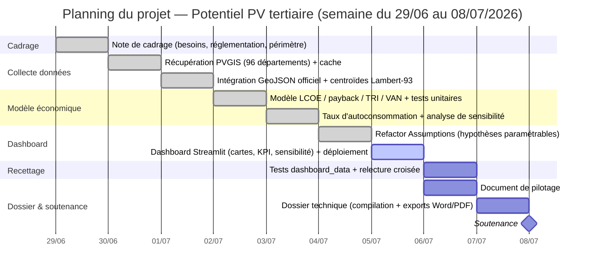

# Document de pilotage de projet

> **Projet** — Potentiel photovoltaïque tertiaire en France (9–500 kWc), à
> granularité départementale, en vue d'un futur module « production locale »
> dans l'outil Simeo (Oxand). Projet exploratoire d'une semaine, mené en
> autonomie par une étudiante en M2 Big Data & IA dans le cadre du workshop
> client.
>
> Ce document couvre l'ensemble des critères de la grille d'évaluation
> « Pilotage du projet ». Chaque section indique explicitement le(s) critère(s)
> qu'elle adresse.

---

## 1. Contexte & parties prenantes

*Critères couverts : (1) respect des contraintes client, (3) réponse aux besoins client.*

| Rôle | Acteur | Responsabilités |
|---|---|---|
| **Client** | **Oxand** — outil **Simeo** (module rénovation énergétique) | Exprime le besoin métier : élargir Simeo, aujourd'hui centré sur l'efficacité énergétique passive (isolation, ventilation, équipements), à un levier de **production locale d'énergie**. Fixe le cadre réglementaire et économique via la note de cadrage. Valide les livrables lors des points hebdomadaires. |
| **Réalisatrice** | Étudiante en M2 Big Data & IA | Cadre le projet, collecte et traite les données, construit le modèle économique, développe le dashboard, documente et présente les résultats. Interlocutrice unique côté production. |
| **Référent pédagogique** | École (workshop client) | Encadre la méthode, évalue selon les grilles fournies (note de cadrage, réalisation Big Data, pilotage, dossier technique), garantit le respect du calendrier académique. |

**Contraintes client identifiées et respectées** (issues de la note de cadrage
`potentiel-pv-france-note-cadrage.md`) :

- **Réglementation** — le projet s'ancre explicitement sur le décret tertiaire,
  la loi APER, RE2020 et REPowerEU (cf. section 2). Le segment retenu (toiture
  tertiaire 9–500 kWc) correspond au champ d'application réel de ces textes et
  au patrimoine bâti couvert par Simeo.
- **Coûts** — aucun budget de licence ou d'infrastructure engagé : sources de
  données ouvertes (PVGIS/JRC, GeoJSON officiel des départements), stack
  Python open-source, hébergement du dashboard sur Streamlit Community Cloud
  (gratuit). Seul coût réel : le temps-homme (cf. section 5).
- **Délais** — projet calibré et livré sur une semaine calendaire, conformément
  au format du workshop ; le planning (section 2) découpe ce délai en lots
  vérifiables.

**Solution apportée vs besoin client** — la note de cadrage posait trois
questions pour Simeo : *combien produit une installation type, combien
coûte-t-elle, est-elle rentable ?* Le livrable y répond concrètement par
département : gisement PVGIS réel, modèle économique testé (LCOE, payback,
TRI, VAN), et un dashboard interactif permettant à Oxand de rejouer les
hypothèses (CAPEX, OPEX, taux d'autoconsommation) sans toucher au code. Le
projet ne construit pas le futur module Simeo mais **caractérise le terrain de
jeu** — exactement le périmètre demandé, ni plus ni moins.

---

## 2. Planning & jalons

*Critères couverts : (2) ajustement aux tendances/obligations réglementaires, (6) planning optimisé et cohérent.*

Le planning prévisionnel d'une semaine est construit pour livrer un noyau
fonctionnel (données + modèle économique) dès le milieu de semaine, condition
nécessaire pour que le dashboard et la documentation finale ne dépendent pas
d'un dérapage amont. L'ordre des lots reflète aussi la hiérarchie des
dépendances techniques : on ne peut pas construire le dashboard avant d'avoir
un modèle économique paramétrable, ni le dossier technique avant d'avoir le
dashboard et le pilotage.

L'ajustement aux obligations réglementaires du client est fait **en amont**,
dès le cadrage : le choix du segment (toiture tertiaire 9–500 kWc), de la
granularité (département) et des indicateurs (LCOE, payback, TRI, VAN) découle
directement de la loi APER (solarisation obligatoire des grandes toitures
tertiaires), du décret tertiaire (objectifs de réduction de consommation
auxquels l'autoconsommation PV contribue), de RE2020 (bâtiments neufs à
énergie positive) et de la trajectoire REPowerEU (600 GW de solaire UE d'ici
2030), qui légitime l'urgence du sujet pour Oxand.

**Jalons clés (planning prévisionnel) :**

| Jalon | Jour | Statut |
|---|---|---|
| Note de cadrage validée | J1 | Fait |
| Jeu de données départemental consolidé | J2 | Fait |
| Modèle économique testé (28 tests) | J3 | Fait |
| Dashboard Streamlit déployé | J4 | En cours |
| Document de pilotage | J4 | En cours (ce document) |
| Recettage & relecture croisée | J5 | À venir |
| Dossier technique remis | J6 | À venir |
| Soutenance | J7 | À venir |

---

## 3. Outils de suivi

*Critères couverts : (4) plateforme de gestion de projet adaptée, (5) outils/modalités de reporting adaptés, (7) visibilité client sur l'avancement.*

Pour un projet solo d'une semaine, l'enjeu n'est pas la coordination
multi-équipe mais la **traçabilité** de l'avancement et la **lisibilité** pour
un client qui n'a pas le temps de suivre le détail technique au quotidien.
Un board Kanban léger (Trello ou Notion, équivalents pour cet usage) est donc
suffisant et évite la sur-ingénierie d'un outil de type Jira.

**Board Kanban** — colonnes `To Do` / `Doing` / `Review` / `Done`, une carte
par lot de travail :

| To Do | Doing | Review | Done |
|---|---|---|---|
| Dossier technique | Dashboard Streamlit | Document de pilotage | Note de cadrage |
| Recettage final | | | Collecte données PVGIS/GeoJSON |
| Soutenance | | | Modèle économique + tests |
| | | | Sensibilité taux d'autoconsommation |

Chaque carte porte : description du livrable, checklist de sous-tâches,
étiquette de risque associée (voir registre section 4), et lien vers le
commit git correspondant une fois en `Done` — ce qui permet un audit rapide
de l'avancement réel (et pas seulement déclaré).

**Canaux de communication client :**

- **Mail** — échanges asynchrones pour les décisions de cadrage (validation du
  périmètre, arbitrages sur les hypothèses économiques) et le partage des
  livrables intermédiaires.
- **Point hebdomadaire** — synchronisation courte (15–30 min) en fin de
  semaine : démonstration de l'avancement sur le board, revue des risques
  ouverts, décision sur les priorités de la période suivante. C'est le
  principal levier de **visibilité client** : le board fait office de
  tableau de bord partagé, consultable à tout moment entre deux points.

---

## 4. Registre des risques

*Critères couverts : (8) détection en temps réel des risques.*

Le registre est tenu à jour en continu (une carte de risque par ligne sur le
board, révisée à chaque point hebdomadaire et à chaque changement d'état
significatif — ex. échec d'un appel PVGIS, dépassement de temps sur un lot).
Cela permet une détection **en continu** plutôt qu'a posteriori : un risque qui
se matérialise (ex. l'API PVGIS renvoie une erreur) est visible immédiatement
dans les logs applicatifs (`src/gisement.py` journalise les échecs et bascule
sur le fallback) et remonté au board dès sa détection.

| Risque | Probabilité | Impact | Mitigation | Statut |
|---|---|---|---|---|
| Indisponibilité / limitation de l'API PVGIS (quota, panne, latence) | Moyenne | Élevé (bloque la collecte des 96 départements) | Cache local des réponses (`src/gisement.py`) dès le premier appel réussi + **fallback synthétique** basé sur un gradient Nord-Sud si l'API est indisponible, pour ne jamais bloquer la suite du pipeline | Maîtrisé — cache + fallback implémentés et testés (`tests/test_gisement.py`) |
| Dérive de périmètre (extension non planifiée : Europe, résidentiel, bâtiment par bâtiment) | Moyenne | Élevé (menace le respect des délais) | Note de cadrage **figée** dès le premier jour, avec un périmètre explicite (France métropolitaine, tertiaire 9–500 kWc, granularité départementale) et une section « hors périmètre / YAGNI » assumée | Maîtrisé — périmètre respecté sur l'ensemble du projet |
| Hypothèses économiques datées ou approximatives (CAPEX, OPEX, tarifs S21) | Élevée (les prix évoluent vite) | Moyen (fausse la précision affichée mais pas la méthode) | Étiquetage explicite de la nature de chaque donnée (réelle / hypothèse / calculée, cf. tableau README) + **analyse de sensibilité** (taux d'autoconsommation 40/65/90 %) pour montrer la robustesse des conclusions plutôt que des valeurs figées ; hypothèses rendues modifiables via la dataclass `Assumptions` et les curseurs du dashboard | Maîtrisé — étiquetage en place, sensibilité disponible dans le notebook et le dashboard |
| Temps limité (une semaine, une seule contributrice) | Élevée | Élevé (risque structurel du format) | Application stricte du principe **YAGNI** (pas d'authentification, pas d'appel PVGIS en direct en production, pas d'extension Europe) et priorisation stricte des lots (données et modèle avant dashboard, dashboard avant documentation finale) | Maîtrisé — arbitrages YAGNI documentés dans la spec technique |
| Dépendance à des données géographiques externes (GeoJSON officiel) mal alignées (projection, découpage) | Faible | Moyen (erreurs de centroïdes/cartes) | Harmonisation explicite des projections (Lambert-93) et des bornes de tranches, revue finale dédiée (commit de fiabilisation) | Maîtrisé |

---

## 5. Suivi des coûts / budget

*Critères couverts : (9) contrôle des coûts.*

Le projet ne mobilise pas de budget matériel (données et outillage
open-source) ; le seul poste de coût est le **temps-homme**, valorisé à un
Taux Journalier Moyen indicatif de **500 €/jour** (ordre de grandeur
consultant junior/étudiant, cohérent avec le contexte du workshop).

| Lot | Jours-homme (prévu) | Coût (prévu, 500 €/j) | Jours-homme (réalisé) | Coût (réalisé) |
|---|---|---|---|---|
| Cadrage (note de cadrage, périmètre, glossaire) | 1,0 | 500 € | 1,0 | 500 € |
| Collecte données (PVGIS, GeoJSON, cache) | 1,0 | 500 € | 1,0 | 500 € |
| Modèle économique (LCOE, payback, TRI, VAN, tests, sensibilité) | 1,5 | 750 € | 1,5 | 750 € |
| Dashboard (refactor `Assumptions`, Streamlit, déploiement) | 1,5 | 750 € | 1,5 | 750 € |
| Recettage (tests complémentaires, relecture croisée) | 0,5 | 250 € | *en cours* | *en cours* |
| Document de pilotage | 0,5 | 250 € | 0,5 | 250 € |
| Dossier technique & exports | 1,0 | 500 € | *à venir* | *à venir* |
| **Total** | **7,0 j** | **3 500 €** | **5,5 j (à date)** | **2 750 € (à date)** |

**Contrôle des écarts** — le suivi prévu/réalisé est mis à jour à chaque
point hebdomadaire à partir du board (une carte déplacée en `Done` clôture le
lot correspondant). À ce stade du projet, aucun écart significatif n'est
constaté : les lots livrés correspondent à l'enveloppe prévue. Le principal
levier de maîtrise reste le YAGNI (section 4) : toute demande d'extension de
périmètre est chiffrée en jours-homme supplémentaires avant acceptation, pour
éviter un dépassement silencieux du budget-temps.

---

## 6. KPI de projet

*Critères couverts : (9) contrôle des coûts (suite), (7) visibilité de l'avancement.*

| KPI | Valeur à date (02/07/2026) | Cible |
|---|---|---|
| **Avancement des jalons** | 4 / 7 jalons atteints (cadrage, données, modèle, dashboard en cours) | 100 % avant soutenance |
| **Couverture de tests** | **28 tests** unitaires passants (`pytest -v` : `test_assumptions`, `test_dashboard_data`, `test_dataset`, `test_economics`, `test_gisement`, `test_viz`) | Maintenir 100 % de tests verts à chaque commit ; étendre au fil des ajouts (dashboard, recettage) |
| **Respect du planning** | 0 jour de retard cumulé à date | ≤ 0,5 jour de dérive en fin de semaine |
| **Écart budgétaire (jours-homme)** | 0 j d'écart prévu/réalisé | Écart < 10 % du budget total (7 j) |

Ces indicateurs sont recalculés à chaque point hebdomadaire et affichés en
tête du board, pour donner au client une vision synthétique de la santé du
projet sans avoir à en lire le détail technique.

---

## 7. Reporting client

*Critères couverts : (5) outils/modalités de reporting (suite), (10) tableau de bord de suivi complet.*

**Cadence** — un point hebdomadaire (le format « une semaine » du workshop
concentre l'essentiel des échanges en début et fin de semaine : cadrage
initial puis restitution), complété par des échanges mail ponctuels pour les
décisions bloquantes (ex. validation d'une hypothèse économique).

**Format** — compte rendu court (une page, structuré : avancement / risques
ouverts / décisions à prendre) accompagné d'une **démonstration live** :
notebook narratif pour l'analyse, puis dashboard Streamlit pour l'exploration
interactive des hypothèses. La démo est le format privilégié car il rend
tangible, en quelques minutes, ce que ferait un futur module Simeo.

**Tableau de bord de suivi consolidé** — le board Kanban (section 3) fait
office de tableau de bord de pilotage unique et complet, articulant :

- les **étapes du projet** (les cartes, une par lot de travail, alignées sur
  les sections de la note de cadrage et de la spec technique) ;
- le **planning** (échéances portées par chaque carte, cohérentes avec le
  Gantt de la section 2) ;
- les **professionnels concernés** (étiquette de rôle sur chaque carte :
  réalisatrice pour l'exécution, client Oxand pour la validation des
  hypothèses métier et réglementaires, référent pédagogique pour le cadrage
  méthodologique) ;
- les **risques actifs** (registre de la section 4, lié en commentaire de
  carte) et les **KPI** (section 6, affichés en en-tête de board).

Ce tableau de bord est l'objet central présenté à chaque point hebdomadaire :
il permet au client de vérifier en un coup d'œil où en est le projet, sans
dépendre d'une lecture technique du code ou des notebooks.
